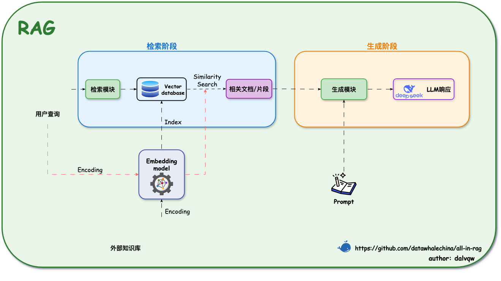
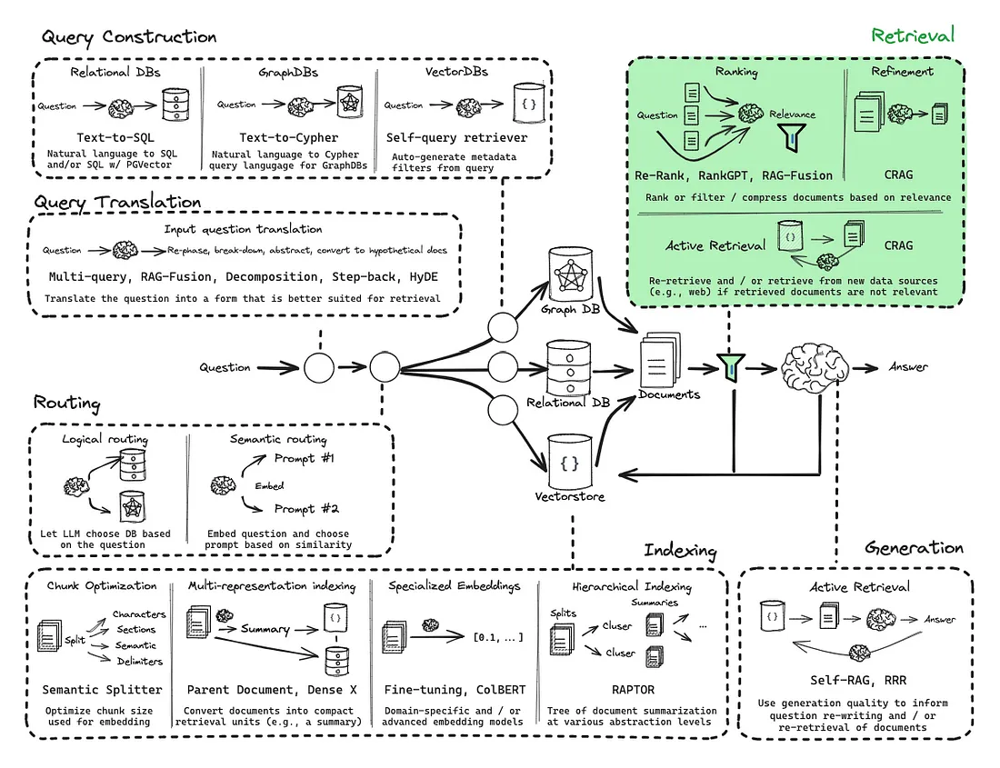
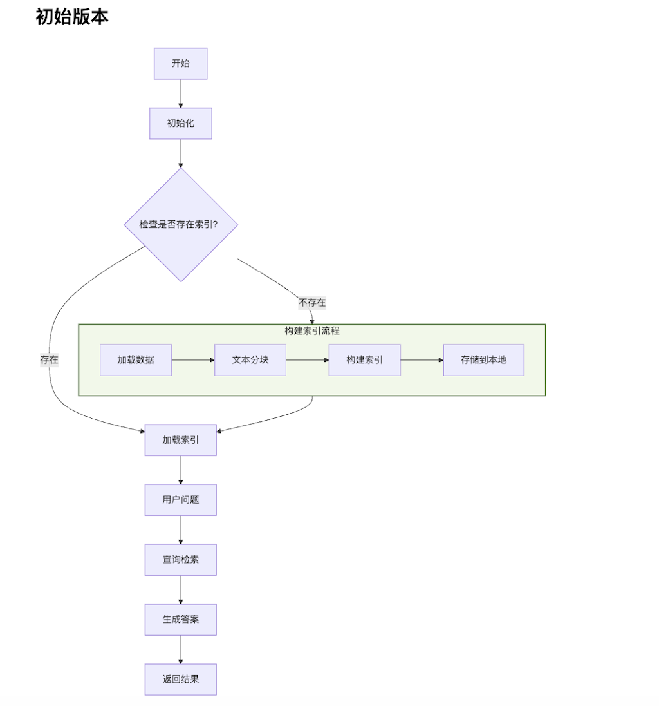

# 今天做什么RAG知识库

本项目基于LLM和RAG系统搭建一个「今天吃什么」的知识库，使用最小可行性产品MVP的原则，从一个初级的通用RAG架构逐渐完善成生产可用的系统。

## 系统架构
通用RAG架构


生产级RAG架构


## 技术和模型
**开发环境**：本地Python虚拟环境（需安装miniConda）
**开发语言**：Python
**核心API**：LangChain
**向量化存储**：FAISS
**LLM模型**：Kimi2.5
**Embedding模型**：BAAI/bge-small-zh-v1.5（远程连接HuggingFace使用）


## 版本及功能
### V1（tag-xx)
#### 版本介绍
使用通用RAG架构对数据做「基于Markdown文档结构的」分块和使用FAISS向量化，并存储到本地。用户输入问题后直接检索发给大模型生成答案。

#### 项目流程


#### 模型效果
针对以下几类问答的回复各有优劣：
1. **给我推荐几道湖南菜**：向量检索不准确（没有语义理解），只取Top k，依赖知识库的回答也不准确，模型自己补充答案，输出格式有废话不统一；
```markdown
> 今天吃什么，给我推荐几道 江浙菜
根据您提供的食谱信息，我来为您分析：

## 符合江浙菜的推荐（1道）

**🐟 鳊鱼炖豆腐** —— 这是经典的江浙家常菜
- **特色**：鳊鱼肉质细嫩，搭配老豆腐炖煮，汤汁奶白浓郁，体现了江浙菜"鲜、嫩、软、滑"的特点
- **关键食材**：鳊鱼、老豆腐、冰糖、料酒、生抽
- **烹饪要点**：用冰糖提鲜（江浙菜典型手法），加入桂皮八角等香料，小火慢炖至汤汁浓稠

## 其他食谱的归属说明

从提供的食谱看，另外两道**不属于江浙菜**：
- **辣椒炒肉**：这是经典**湘菜**（湖南菜），以辣为主，与江浙菜的清淡鲜甜风格不同
- **黄油煎虾**：属于**西式/融合菜**，使用黄油和黑胡椒，不是传统江浙做法

---

## 额外推荐（如需更多选择）

如果您想尝试更多地道江浙菜，建议关注：
- **东坡肉**（杭帮菜代表）
- **糖醋排骨**（酸甜口，沪菜经典）
- **清蒸鲈鱼**（保留原味的苏菜）
- **腌笃鲜**（春笋咸肉炖汤，春季必吃）
- **响油鳝丝**（本帮菜经典）

**建议今天就做那道鳊鱼炖豆腐**，鱼肉鲜嫩，豆腐吸满汤汁，配米饭非常合适！需要具体的烹饪步骤吗？
```

2. **水煮鱼怎么做**：文档分成多个子块后，向量检索只能查到部分子块，依赖知识库的回答残缺不完整，模型自己补充答案，但是不可靠不统一；
```markdown
> 水煮鱼怎么做
根据您提供的食谱信息，**目前文档中关于水煮鱼的具体制作步骤是缺失的**，仅包含以下基础信息：

## 现有信息总结
- **菜品特点**：中等难度硬菜（★★★★），初学者预计用时约 **2 小时**
- **推荐食材**：巴沙鱼（富含优质蛋白且脂肪含量低），搭配时令蔬菜
- **营养特点**：高蛋白、低脂肪，配合蔬菜营养健康

## 信息不足说明
很抱歉，提供的食谱文档中**未包含水煮鱼的具体操作步骤**，例如：
- 鱼肉的切片与腌制方法
- 配菜（豆芽、白菜等）的处理
- 底料（花椒、干辣椒、豆瓣酱等）的炒制
- 煮鱼的火候控制
- 最后淋热油的"泼油"关键步骤

## 建议
由于水煮鱼对刀工（片鱼）、火候（煮制时间）和调味（麻辣底料）要求较高，建议您：
1. 查找包含详细步骤的完整水煮鱼食谱
2. 或选择文档中提供的**红烧鱼/红烧鲤鱼**做法（文档包含完整的煎鱼、调味、收汁步骤），但这与水煮鱼的清爽麻辣口感完全不同

如果您需要，我可以基于一般烹饪知识为您介绍水煮鱼的标准做法框架，但请注意这**并非来自您提供的食谱文档**。
```