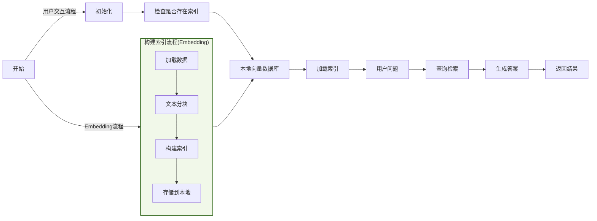
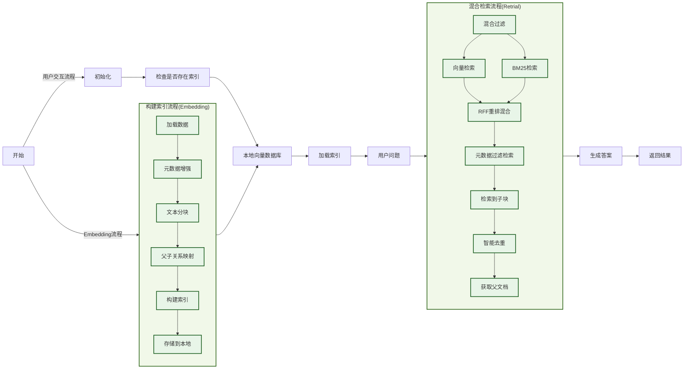
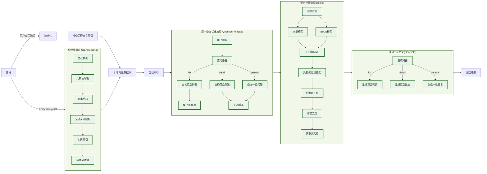
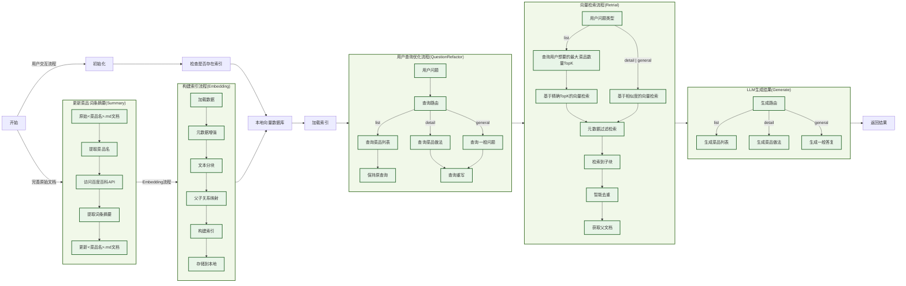

# 今天吃什么RAG知识库

本项目基于LLM和RAG系统搭建一个「今天吃什么」的知识库，使用最小可行性产品MVP的原则，从一个初级的通用RAG架构逐渐完善成生产可用的系统。

## 系统架构
**通用RAG架构**


**生产级RAG架构**


## 技术和模型
- **开发环境**：本地Python虚拟环境（需安装miniConda）
- **开发语言**：Python
- **核心API**：LangChain
- **向量化存储**：FAISS
- **LLM模型**：Kimi2.5
- **Embedding模型**：BAAI/bge-small-zh-v1.5（远程连接HuggingFace使用,需🪜）

## 安装使用
### 初始化python环境
**安装miniConda**
```bash
wget https://repo.anaconda.com/miniconda/Miniconda3-latest-Linux-x86_64.sh -O ~/miniconda.sh
bash ~/miniconda.sh
```
- 按 Enter 阅读许可协议
- 输入 yes 同意协议
- 安装路径提示时直接按 Enter（使用默认路径 /home/ubuntu/miniconda3）
- 是否初始化Miniconda：输入 yes 将Miniconda添加到您的PATH环境变量中。
```bash
source ~/.bashrc
conda --version
```
如果显示版本号，说明安装成功。

为了加快后续使用 conda 安装包的速度，强烈建议配置国内镜像源。打开一个新的终端或 Anaconda Prompt，运行以下命令：
```bash
conda config --add channels https://mirrors.tuna.tsinghua.edu.cn/anaconda/pkgs/main/
conda config --add channels https://mirrors.tuna.tsinghua.edu.cn/anaconda/pkgs/free/
conda config --set show_channel_urls yes
```
配置完成后，可以通过 `conda config --show channels` 命令查看已添加的源。

**配置API_KEY**
从MoonShot开发者平台申请API_KEY，配置到本地环境变量文件 `~/.bashrc` 中。
```bash
export MOONSHOT_API_KEY=[你的大模型 API 密钥]
```
保存文件后退出并执行 `source ~/.bashrc` 命令生效。

**创建虚拟环境**
```bash
conda create -n cook-rag python=3.12.11
conda activate cook-rag
```

**安装依赖文件**
```bash
pip install -r requirements.txt
```

**启动程序**
```bash
python main.py
```

## 版本及功能
### V1（tag-v1.0.0)
#### 版本介绍
使用通用RAG架构对数据做「基于Markdown文档结构的」分块和使用FAISS向量化，并存储到本地。用户输入问题后直接检索后，使用提示词发给大模型生成答案。

#### 项目流程


#### 提示词
输入用户问题和向量检索结果，使用简单的提示词让大模型生成答案。
```markdown
你是一位专业的烹饪助手。请根据以下食谱信息回答用户的问题。

用户问题: {question}

相关食谱信息:
{context}

请提供详细、实用的回答。如果信息不足，请诚实说明。
```

#### 模型效果
针对以下两类问答的回复各有优劣：
1. **给我推荐几道xx菜**：向量检索不准确（没有语义理解），只取Top k，依赖知识库的回答也不准确，模型自己补充答案，输出格式有废话不统一；

<details>
  <summary>点击查看示例</summary>

```markdown

> 今天吃什么，给我推荐几道江浙菜
根据您提供的食谱信息，我来为您分析：

## 符合江浙菜的推荐（1道）

**🐟 鳊鱼炖豆腐** —— 这是经典的江浙家常菜
- **特色**：鳊鱼肉质细嫩，搭配老豆腐炖煮，汤汁奶白浓郁，体现了江浙菜"鲜、嫩、软、滑"的特点
- **关键食材**：鳊鱼、老豆腐、冰糖、料酒、生抽
- **烹饪要点**：用冰糖提鲜（江浙菜典型手法），加入桂皮八角等香料，小火慢炖至汤汁浓稠

## 其他食谱的归属说明

从提供的食谱看，另外两道**不属于江浙菜**：
- **辣椒炒肉**：这是经典**湘菜**（湖南菜），以辣为主，与江浙菜的清淡鲜甜风格不同
- **黄油煎虾**：属于**西式/融合菜**，使用黄油和黑胡椒，不是传统江浙做法

---

## 额外推荐（如需更多选择）

如果您想尝试更多地道江浙菜，建议关注：
- **东坡肉**（杭帮菜代表）
- **糖醋排骨**（酸甜口，沪菜经典）
- **清蒸鲈鱼**（保留原味的苏菜）
- **腌笃鲜**（春笋咸肉炖汤，春季必吃）
- **响油鳝丝**（本帮菜经典）

**建议今天就做那道鳊鱼炖豆腐**，鱼肉鲜嫩，豆腐吸满汤汁，配米饭非常合适！需要具体的烹饪步骤吗？

```
</details>

2. **水煮鱼怎么做**：文档分成多个子块后，向量检索只能查到部分子块，依赖知识库的回答残缺不完整，模型自己补充答案，但是不可靠不统一；

<details>
  <summary>点击查看示例</summary>

```markdown

> 水煮鱼怎么做
根据您提供的食谱信息，**目前文档中关于水煮鱼的具体制作步骤是缺失的**，仅包含以下基础信息：

## 现有信息总结
- **菜品特点**：中等难度硬菜（★★★★），初学者预计用时约 **2 小时**
- **推荐食材**：巴沙鱼（富含优质蛋白且脂肪含量低），搭配时令蔬菜
- **营养特点**：高蛋白、低脂肪，配合蔬菜营养健康

## 信息不足说明
很抱歉，提供的食谱文档中**未包含水煮鱼的具体操作步骤**，例如：
- 鱼肉的切片与腌制方法
- 配菜（豆芽、白菜等）的处理
- 底料（花椒、干辣椒、豆瓣酱等）的炒制
- 煮鱼的火候控制
- 最后淋热油的"泼油"关键步骤

## 建议
由于水煮鱼对刀工（片鱼）、火候（煮制时间）和调味（麻辣底料）要求较高，建议您：
1. 查找包含详细步骤的完整水煮鱼食谱
2. 或选择文档中提供的**红烧鱼/红烧鲤鱼**做法（文档包含完整的煎鱼、调味、收汁步骤），但这与水煮鱼的清爽麻辣口感完全不同

如果您需要，我可以基于一般烹饪知识为您介绍水煮鱼的标准做法框架，但请注意这**并非来自您提供的食谱文档**。
```

</details>

#### 存在问题
- 仅支持向量检索，不理解用户语义，生成结果不准确
- 文本分块后检索，上下文不充分，生成结果不完整

### V1.2（tag-v1.2.0)
#### 版本介绍
在V1.0版本的通用RAG架构基础上，针对性的做了以下功能和优化：
- **检索优化**：优化查询检索方式，使用向量检索+关键词检索，并使用RRF策略混合输出最终TopK
- **数据构建**：文本分块时构建元数据，检索时在混合检索步骤后再做元数据过滤缩小检索范围
- **上下文扩展**：使用"小块检索，大块生成"策略，文本分块时添加子块和父块映射，实现上下文扩展
- **智能去重**：检索到多个子块后（可能存在重复），进行排序去重后，再获取父文档给大模型生成

#### 项目流程


#### 提示词
该版本的提示词和V1.0版本的保持不变。

#### 模型效果
针对以下三类问答的回复有所改进：
1. **给我推荐几道早餐**：向量检索可以准确检索到用户想要的早餐，而不是随机返回其他菜品，说明元数据增强和混合检索后的基于元数据的过滤生效了。但是用户可能只要菜品名字，不需要详细做法，回答可以再简洁一些，只给菜品名。

<details>
  <summary>点击查看示例</summary>

```markdown

根据您提供的食谱信息，我为您推荐以下两道营养早餐：

## 1. 牛奶燕麦（极简快手版）

**适合人群**：时间紧张的上班族、厨房新手、追求效率的懒人

**核心优势**：
- **难度极低**：★（非常简单）
- **极速出餐**：3分钟即可完成
- **营养均衡**：高蛋白+粗谷物纤维，饱腹感强

**食材配比**（单人份）：
- 牛奶 280ml（巴氏奶口感更佳）
- 快煮燕麦 40g
- 鸡蛋 1个（煎蛋搭配）

**制作要点**：
- **极速法**：快煮燕麦+牛奶混合，微波炉中火4分钟（注意容器不要超过50%容量，避免溢出）
- **常规法**：燕麦用200ml水煮沸2分钟后捞出，倒入冷牛奶中（口感更清爽）
- **煎蛋**：热锅少油，每面20秒，可撒3g椒盐提味

**搭配建议**：可加入水果、蔬菜或苏打饼干丰富口感

---

## 2. 燕麦鸡蛋饼（健身优选版）

**适合人群**：健身人群、需要持久饱腹感的上班族、喜欢热食的人

**核心优势**：
- **营养密度高**：含39g碳水、30g蛋白质、19g脂肪，共450kcal
- **口感丰富**：可咸可甜，可加入蔬菜（如菠菜）
- **便携性强**：饼状方便携带

**食材配比**（单人份）：
- 鸡蛋2个（或2个蛋清+1个蛋黄）
- 纯干燕麦片 50g
- 牛奶 50-100g（调至粘稠即可）
- 蔬菜碎叶一把（可选）

**制作要点**：
- **混合顺序**：牛奶与燕麦先混合至粘稠→加入打散的鸡蛋液搅拌均匀
- **火候控制**：必须使用**小火**，平底锅刷黄油，先煎2-3分钟，翻面再煎2分钟
- **调味建议**：咸口可在蛋液中加入盐、胡椒；甜口可搭配剩余牛奶食用

**关键提醒**：煎饼时务必小火，避免燕麦糊底

---

## 选择建议

| 需求场景 | 推荐选择 | 理由 |
|---------|---------|------|
| **赶时间/极简主义** | 牛奶燕麦 | 3分钟完成，无需厨艺，清洗简单 |
| **健身增肌/高强度工作** | 燕麦鸡蛋饼 | 蛋白质更高（30g），热量充足（450kcal），饱腹感持续更久 |
| **冬季/喜欢热食** | 燕麦鸡蛋饼 | 热食更暖胃，口感更扎实 |
| **夏季/清爽口感** | 牛奶燕麦 | 常温或冷藏牛奶搭配，入口舒适 |

两道早餐都基于燕麦和鸡蛋，食材重叠度高，您可以根据当天的时间和心情灵活选择！
```

</details>

2. **水煮鱼怎么做**：LLM给出的水煮鱼做法是根据知识库中水煮鱼的完整文档生成的，可见“小块检索、大块生成”的策略已经实现和生效，V1.0中向量检索的知识库不完整问题也不见了，在提示词不变的情况下，生成质量有明显的提升。

<details>
  <summary>点击查看示例</summary>

```markdown

**水煮鱼**是一道经典的川菜，以麻辣鲜香著称。根据食谱，这是一道**难度较高**（★★★★）的硬菜，使用巴沙鱼制作，搭配时令蔬菜，营养丰富。以下是详细做法：

---

### 🛒 **必备原料和工具**（3-5人份）

**主料：**
- 巴沙鱼：500g（需提前解冻）
- 时令蔬菜：300-500g（如土豆片、豆芽、花菜、生菜等，自由搭配）

**调味料：**
- 红油豆瓣酱：40g（嗜辣可再加10-20g）
- 豆豉：10g（可选）
- 藤椒油：10ml
- 菜籽油：25ml
- 白胡椒粉：3g
- 大蒜：2瓣
- 盐：5g（腌制用）+ 2g（调味用）
- 糖：2g

**工具：**
大不锈钢碗、量杯、厨房秤（可选）

---

### 👨‍🍳 **详细制作步骤**

#### **第一步：解冻与切片**
- **解冻**：冷冻巴沙鱼需室温自然解冻约**5小时**
- **切片技巧**：将鱼切成约**5cm长、3cm宽**的薄片
  - *切法要点*：垂直于鱼肉长条方向先剁成5cm的段，翻转90度斜着撇成薄片

#### **第二步：腌制（关键步骤）**
1. 鱼片放入大碗中，加入：
   - 豆瓣酱 30g
   - 盐 3g
   - 藤椒油 10ml
   - 白胡椒粉 3g
2. **用手轻轻抓匀**（不要太用力，以免鱼肉碎裂）
3. 加入 5ml 菜籽油"封油"锁住味道
4. **常温静置至少30分钟**入味

#### **第三步：准备配菜**
- 大蒜切成蒜末
- 蔬菜洗净：以花菜300g+生菜200g为例
- **花菜**：开水锅焯水备用
- **生菜**：洗净晾干，直接炒熟（**不放油**）

#### **第四步：炒制底料**
- 热锅冷油（菜籽油 20ml）
- 加入**10g豆瓣酱**、**10g豆豉**（可选）、**蒜末**
- **中火**慢炒出香味

#### **第五步：汆烫鱼片**
1. 锅中加入**150ml热水**
2. 水快开时，轻轻放入腌制好的鱼片
3. 用锅铲**轻轻翻动**让鱼片在水中散开（避免炒碎）
4. 加入**2g盐**和**2g糖**调味（可根据口味调整）
5. **水再次沸腾后即可出锅**（不要煮太久，以免鱼肉变老）

#### **第六步：盛盘**
1. 先将炒好的蔬菜垫在大碗底部
2. 将鱼片盛在蔬菜上面
3. 浇上锅中剩余的热汤即可！

---

### 💡 **重要提示与技巧**

1. **蔬菜搭配技巧**：
   - 垫底蔬菜可自由发挥，但**土豆需要先煮熟**（用筷子能戳透为准）
   - 花菜需焯水，生菜可直接干炒

2. **口味调整**：
   - 红油豆瓣酱决定辣度，可根据承受能力增减
   - 盐的用量分两次控制：腌制时固定，汆烫时可尝后调整

3. **操作要点**：
   - 鱼片要**斜着撇片**，这样厚薄均匀更易熟
   - 腌制时**轻柔抓拌**，保持鱼片完整
   - 汆烫时间**不宜过长**，水开即熟，保持嫩滑口感

4. **安全提醒**：
   - 处理冷冻鱼时注意完全解冻，避免外熟里生
   - 炒豆瓣酱时用中火，避免糊锅发苦

**预估用时**：初学者约需**2小时**（含解冻和腌制时间）

祝你做出麻辣鲜香、鱼肉嫩滑的水煮鱼！如有具体步骤不清楚，欢迎追问。
```

</details>

3. **我想吃下午茶了**：用户输入意图描述不够清晰，既没有说明是要下午茶清单、还是要下午茶做法，直接提供给用户大量做法信息，可能不太符合用户意图。

<details>
  <summary>点击查看示例</summary>

```markdown

根据您提供的食谱信息，我强烈推荐**英式司康**作为您的下午茶选择！这是一道经典的下午茶点心，制作相对简单，非常适合搭配茶或咖啡享用。

## 🫖 为什么推荐英式司康？

- **专为下午茶设计**：食谱明确说明这是"非常简单快手的下午茶甜品"
- **风味适中**：以蛋奶香气为主，糖量适中不会过于甜腻，非常适合下午时段
- **搭配灵活**：可搭配果酱、奶油奶酪、茶或咖啡
- **分享适宜**：一份正好够 4-6 人享用，适合与家人朋友分享

---

## 👨‍🍳 制作指南

### 所需材料（4-6人份）
- 无盐黄油 40g（推荐总统牌）
- 低筋面粉 180g
- 糖 30g
- 盐 1g
- 泡打粉 5g
- 鸡蛋 1个（约50g）
- 淡奶油 45g
- 奶油奶酪 50g（可选，但推荐）

### 详细步骤

**准备工作（15分钟）：**
1. **制作蛋奶液**：鸡蛋打散，取30g蛋液与淡奶油、奶油奶酪混合均匀。如果奶酪太硬，可水浴加热至40°C再混合
2. **混合干粉**：将低筋面粉、盐、糖、泡打粉放入容器混合均匀

**制作面团（10分钟）：**
3. **搓油**：黄油切小块，放入干粉中，用手捏搓成**粗玉米粉质地**（这是司康蓬松的关键）
4. **混合**：倒入蛋奶液，轻轻搅拌叠压成均匀面团（不要过度揉搓，避免出筋）

**成型与烘烤（35分钟）：**
5. **整形**：擀成1.5cm厚的面片，切成6个扇形（或用心形/圆形模具）
6. **刷蛋液**：用剩余20g蛋液刷表面，烤出金黄色泽
7. **烘烤**：烤箱预热180°C，烤27分钟

---

## 💡 下午茶搭配建议

**经典组合：**
- 趁热撕开司康，涂抹**草莓酱+凝脂奶油**（Clotted Cream）
- 搭配食谱中的**冬瓜茶**（清爽解腻）或英式红茶、拿铁咖啡

**进阶变化：**
- 可在面团中加入葡萄干、蔓越莓干或橙皮丁增加口感层次
- 如果没有奶油奶酪，可省略，但口感会稍欠浓郁

**保存提示：**
- 刚出炉最佳，常温当天食用完毕
- 吃不完密封保存，第二天复烤3-5分钟恢复酥脆

**预估时间**：准备20分钟 + 烘烤27分钟 = **约50分钟**

祝您下午茶愉快！如果想喝饮品搭配，文档中的冬瓜茶也是不错的选择，清爽解腻，与司康的奶香形成完美互补。
```

</details>

#### 存在问题
- 用户问“给我推荐几道xx菜”，回答包含菜品做法，冗长不够简洁，可以改为只推荐菜品名字；
- 用户查询不太清晰的时候，生成内容偏向菜品详细做法，可能不符合用户意图（用户可能是到店点单、也可能是在家做菜），要能够准确识别用户意图，生成可靠的答案。

### V1.5（tag-v1.5.0）
#### 版本介绍
在V1.2版本的基础上，针对性地做了以下功能和优化：
- **路由规则**：根据用户不同的查询意图，生成不同的查询类型；根据不同大的查询类型，使用不同方式生成回复；包括查询路由和生成路由。
- **查询重写**：对用户描述不清楚的问题，进行前置的LLM翻译重写（也可多轮交互），明确问题意图后再发送LLM生成答案。

#### 项目流程


#### 提示词
LLM识别用户问题后对其进行路由分类和查询重写，分为「查询菜品列表」、「查询菜品做法」和「查询一般问题」三种类型：

**查询路由规则提示词**
<details>
  <summary>点击查看提示词</summary>

```python
QUESTION_ROUTER_PROMPT = """
根据用户的问题，将其分类为以下三种类型之一：

1. 'list' - 用户想要获取菜品列表或推荐，只需要菜名
   例如：推荐几个素菜、有什么川菜、给我3个简单的菜

2. 'detail' - 用户想要具体的制作方法或详细信息
   例如：宫保鸡丁怎么做、制作步骤、需要什么食材

3. 'general' - 其他一般性问题
   例如：什么是川菜、制作技巧、营养价值

请只返回分类结果：list、detail 或 general

用户问题: {query}

分类结果:"""
```
</details>

「查询菜品列表」类问题比较简单不需要做查询重写，「查询菜品做法」和「查询一般问题」两种类型问题则需要根据「用户查询重写规则」进行优化：

**查询重写规则提示词**
<details>
  <summary>点击查看提示词</summary>

```python
QUESTION_REWRITE_PROMPT = """
你是一个智能查询分析助手。请分析用户的查询，判断是否需要重写以提高食谱搜索效果。

原始查询: {query}

分析规则：
1. **具体明确的查询**（直接返回原查询）：
   - 包含具体菜品名称：如"宫保鸡丁怎么做"、"红烧肉的制作方法"
   - 明确的制作询问：如"蛋炒饭需要什么食材"、"糖醋排骨的步骤"
   - 具体的烹饪技巧：如"如何炒菜不粘锅"、"怎样调制糖醋汁"

2. **模糊不清的查询**（需要重写）：
   - 过于宽泛：如"做菜"、"有什么好吃的"、"推荐个菜"
   - 缺乏具体信息：如"川菜"、"素菜"、"简单的"
   - 口语化表达：如"想吃点什么"、"有饮品推荐吗"

重写原则：
- 保持原意不变
- 增加相关烹饪术语
- 优先推荐简单易做的
- 保持简洁性

示例：
- "做菜" → "简单易做的家常菜谱"
- "有饮品推荐吗" → "简单饮品制作方法"
- "推荐个菜" → "简单家常菜推荐"
- "川菜" → "经典川菜菜谱"
- "宫保鸡丁怎么做" → "宫保鸡丁怎么做"（保持原查询）
- "红烧肉需要什么食材" → "红烧肉需要什么食材"（保持原查询）

请输出最终查询（如果不需要重写就返回原查询）:"""
```
</details>

根据重写后的用户问题检索到父文档之后，对不同用户查询类型使用不同的生成规则，其中「生成菜品列表」直接从混合检索的父文档中提取菜品名字，不需要经过LLM生成，「生成菜品做法」和「生成一般答复」需要依赖检索到的父文档进行LLM生成：

**生成菜品做法提示词**
<details>
  <summary>点击查看提示词</summary>

```python
GENERATE_DETAIL_PROMPT = """
你是一位专业的烹饪导师。请根据食谱信息，为用户提供详细的分步骤指导。

用户问题: {question}

相关食谱信息:
{context}

请灵活组织回答，建议包含以下部分（可根据实际内容调整）：

## 🥘 菜品介绍
[简要介绍菜品特点和难度]

## 🛒 所需食材
[列出主要食材和用量]

## 👨‍🍳 制作步骤
[详细的分步骤说明，每步包含具体操作和大概所需时间]

## 💡 制作技巧
[仅在有实用技巧时包含。优先使用原文中的实用技巧，如果原文的"附加内容"与烹饪无关或为空，可以基于制作步骤总结关键要点，或者完全省略此部分]

注意：
- 根据实际内容灵活调整结构
- 不要强行填充无关内容或重复制作步骤中的信息
- 重点突出实用性和可操作性
- 如果没有额外的技巧要分享，可以省略制作技巧部分

回答:"""
```
</details>

**生成一般答复提示词**

<details>
  <summary>点击查看提示词</summary>

```python
GENERATE_NORMAL_ANSWER = """
你是一位专业的烹饪助手。请根据以下食谱信息回答用户的问题。

用户问题: {question}

相关食谱信息:
{context}

请提供详细、实用的回答。如果信息不足，请诚实说明。

回答:
"""
```
</details>

#### 模型效果
针对以下两类问题的回复效果有明显改进:
1. **给我推荐几道早餐**：直接生成菜品清单，不会展示过多冗余信息。

<details>
  <summary>点击查看示例</summary>

```markdown

为您推荐以下菜品：
1. 燕麦鸡蛋饼
2. 温泉蛋
3. 牛奶燕麦
```
</details>

2. **我想吃下午茶了，有什么推荐的？**

<details>
  <summary>点击查看示例</summary>

```markdown
> 我想吃下午茶了，有什么推荐的？
为您推荐以下菜品：
1. 奶茶
2. 温泉蛋
3. 英式司康

> 英式司康好吃吗？
根据食谱信息，英式司康的风味特点是：**以蛋奶香气为主轴，糖量适中且不会过于甜腻**。

从食谱描述来看，这是一款比较受欢迎的下午茶甜品，具有以下特点：

**风味口感**
- 蛋奶香气浓郁（使用了黄油、鸡蛋、淡奶油和可选的奶油奶酪）
- 甜度适中，不会甜腻（每份仅使用30g糖）
- 口感应该是酥松的（通过黄油搓入面粉和泡打粉的作用）

**适合场景**
- 作为下午茶点心非常合适
- 推荐搭配果酱、茶或咖啡食用

**制作角度**
- 属于"简单快手"的甜品，难度中等（★★★）
- 从准备到烤制完成约需1小时左右

**主观评价**
是否"好吃"因人而异。如果您喜欢：
- 奶香浓郁的烘焙点心
- 不太甜的甜品
- 酥松的口感（类似饼干和蛋糕之间的质地）
- 搭配果酱或茶饮食用

那么这款司康很可能会符合您的口味。它经典的英式下午茶定位也说明了其风味接受度较广。

如果您偏好重口味、特别甜或咸的点心，可能需要调整配方（如增加糖分或添加果干、芝士等配料）。

```
</details>

#### 存在问题
- **Top K检索造成Token浪费和查询受限**：目前检索流程都是按照Top K的规则检索的，如果用户查询"英式司康怎么做"这类问题，只会用到英式司康这一份父文档，检索到的Top K中的其他文档也会发送给LLM，造成比较严重的Token浪费；另外如果用户查询“给我推荐5-10道早餐”，Top K中的K=3，最多只会返回3道菜品，也会让用户感觉到不满；
- **原文档缺少分类标签限制用户发散查询**：目前支持的用户查询类型有限，如果用户查询"给我推荐几道川菜"，由于目前的菜品分类中没有菜系分类，所以混合检索无法准确地检索到川菜，返回的结果就比较随机；同理如果用户查询“我想吃西餐了”，西餐又包括很多类型比如牛排、甜点、料理等，需要在知道西餐分类的基础上和用户进一步交互，才能了解到用户具体的查询意图。

### V1.8（tag-v1.8.0）
#### 版本介绍
该版本针对V1.5版本存在的问题进行以下的调整：
- **优化检索方式**：针对不同类型查询，使用不同向量检索方式（list-基于TopK检索，detail和general-基于相似度检索），优化V1.5版本中Top K检索造成的Token浪费和查询受限问题；由于基于本地内存的BM25检索不支持相似度检索，且重排后会影响检索质量，该版本中取消混合检索和RRF重排。
- **完善原始文档**：在每个菜品的markdown文件头部添加了菜品的介绍信息，来源于百度百科词条的摘要（相关API爬虫文档见<docs/百度百科菜品摘要API爬虫.md>）。这部分信息包含了菜品的基础信息、菜系、口味等通用信息，可以大幅提高用户查询检索的命中率。
#### 项目流程


#### 提示词
该版本中的提示词和V1.5版本中基本保持不变，仅新增了「推测用户想要的菜品的最大数量」提示词：

<details>
  <summary>点击查看提示词</summary>

   ```python
GENERATE_LIST_TOPK = """
假设用户提问「给我推荐5-10道川菜」类似问题，提取出用户最多想要多少道菜，返回数字即可，如果无法推测出用户最多想要多少道菜，返回-1。

用户问题: {question}

回复原则：
- 准确理解用户问题
- 准确提取最大数字
- 最大数字必须为正整数
- 不确定返回-1

示例：
- "给我推荐几道湘菜" -> -1
- "给我推荐3-5道粤菜" -> 5

请准确输出用户最多想要多少道菜:"""
   ```
</details>

#### 模型效果
针对以下几类问题的检索过程和回复结果都有明显改进：
1. **英式司康怎么做**：对于「xx菜品怎么做」这类d问题，改为使用相似度检索(相似度>0.6)，从运行日志来看就只检索到「英式司康」一份父文档，没有多余的文档输入给LLM了，也显著降低了的Token浪费。
<details>
  <summary>点击查看示例</summary>

```markdown
> 英式司康怎么做
2026-06-17 10:24:53,872 - INFO - HTTP Request: POST https://api.moonshot.cn/v1/chat/completions "HTTP/1.1 200 OK"
2026-06-17 10:24:53,883 - INFO - 用户问题类型分类为：detail
2026-06-17 10:25:01,487 - INFO - HTTP Request: POST https://api.moonshot.cn/v1/chat/completions "HTTP/1.1 200 OK"
2026-06-17 10:25:01,490 - INFO - 用户查询无须改写：英式司康怎么做
2026-06-17 10:25:01,531 - INFO - 使用向量检索器检索到 1 个相关文档块
2026-06-17 10:25:01,531 - INFO - 元数据过滤文档：从 1 个文档中过滤菜品品类和难度后只保留 1 个文档
2026-06-17 10:25:01,532 - INFO - 从 1 个子文档中找到 1 个去重父文档: 英式司康(1块)
2026-06-17 10:25:01,532 - INFO - 检索到 1 个相关文档块
2026-06-17 10:25:01,532 - INFO - 使用「菜品步骤LLM生成器」生成结果中...
2026-06-17 10:25:47,710 - INFO - HTTP Request: POST https://api.moonshot.cn/v1/chat/completions "HTTP/1.1 200 OK"
## 🥘 菜品介绍

英式司康（Scone）是英式下午茶的核心点心，这款配方在传统基础上加入奶油奶酪，赋予更浓郁的奶香和细腻质地。成品外酥内软，带有温和蛋香，甜度适中，非常适合搭配草莓果酱、凝脂奶油（Clotted Cream）或红茶食用。

**难度等级**：★★★（中等）
**制作时长**：约50分钟（含烘烤）
**适合人数**：4-6人

---

## 🛒 所需食材

| 食材 | 用量 | 备注 |
|------|------|------|
| **无盐黄油** | 40g | 必须冷藏状态，推荐总统牌 |
| **低筋面粉** | 180g | 过筛备用 |
| **细砂糖** | 30g | 可根据口味增减5g |
| **盐** | 1g | 提升风味层次 |
| **泡打粉** | 5g | 蓬松关键，确保未过期 |
| **鸡蛋** | 1个（约50g） | 分两次使用：30g入面团，20g刷表面 |
| **淡奶油** | 45g | 可用全脂牛奶替代，但口感稍逊 |
| **奶油奶酪** | 50g | 可选但推荐，增加湿润度 |

---

## 👨‍🍳 制作步骤

### 第一阶段：预混合（5分钟）

**步骤1：调配湿性材料**
- 鸡蛋打散，精确称取 **30g蛋液** 放入搅拌碗
- 加入45g淡奶油和50g奶油奶酪
- 搅拌至顺滑无颗粒状态（如奶酪过硬，隔40℃温水软化后再混合）
- *剩余20g蛋液留作表面装饰用*

**步骤2：混合干性材料**
- 大碗中倒入180g低筋面粉、30g糖、1g盐、5g泡打粉
- 用打蛋器搅拌20秒，确保泡打粉均匀分布

### 第二阶段：面团制作（10分钟）

**步骤3：搓入黄油（关键步骤）**
- 将40g冷藏黄油切成1cm见方的小丁
- 倒入干粉中，用手指快速搓捻
- **目标质地**：粗玉米粉状（类似新鲜面包屑），无明显大颗粒黄油即可
- *操作提示*：动作要迅速，若感觉黄油开始融化，可将碗放入冰箱冷藏5分钟再继续

**步骤4：轻压成团**
- 将步骤1的蛋奶液倒入粉油混合物中
- 用刮刀切拌至无干粉状态（约10下，切勿过度搅拌）
- 倒至案板，用手 **"叠压"** 成型：将面团对折按压，重复2-3次至均匀即可
- **禁忌**：不要像揉面包一样揉搓，避免面筋形成导致口感变硬

### 第三阶段：成型与烘烤（35分钟）

**步骤5：整形切割**
- 擀面杖轻擀成 **1.5cm厚** 的圆片（厚度必须均匀，这是蓬松的关键）
- 用刮刀切成6个扇形，或使用5cm圆形模具压出形状
- 切割时动作利落，不要来回锯，以免影响膨胀

**步骤6：表面处理**
- 用刷子将剩余20g蛋液薄涂在司康表面和侧面
- 蛋液可让成品呈现诱人的金红色光泽

**步骤7：烘烤**
- 烤箱提前预热至 **180℃**（预热需10-15分钟，请提前开启）
- 中层烘烤 **27分钟**
- **完成标准**：表面深金黄，底部轻敲有空洞声，内部无湿面糊粘连

---

## 💡 专业贴士

**1. 温度控制法则**
黄油必须保持固态冷藏状态，操作环境温度建议低于20℃。如夏季制作，可将面粉和工具提前冷藏30分钟，防止黄油在搓揉过程中融化导致成品扁平。

**2. "叠压"手法详解**
将粗糙面团聚拢后，用手掌根部轻压展开，对折，转90度再压开，重复2-3次。面团表面应保持略显粗糙、有裂缝的状态，光滑的面团意味着过度揉捏。

**3. 厚度与膨胀关系**
1.5cm是最佳厚度，低于1cm会烤成饼干口感，超过2cm则中心难熟。切割后直接入炉，不要移动或重新整形，保持切口锋利有助于垂直膨胀。

**4. 赏味与保存**
出炉后冷却5分钟为最佳食用期，外壳酥脆、内部松软。常温密封保存2天，或冷冻保存1个月。复热时表面喷水，180℃烤3-5分钟即可恢复口感。
```
</details>

2. **给我推荐5-10道川菜**：对于「给我推荐多少道xx菜」这类问题，可以精确识别用户想要的最大菜品数量，同时由于原文档中添加了百度百科菜品的词条摘要，补充了菜品的菜系、口味等描述，输出的结果更加地符合用户的意图。
<details>
  <summary>点击查看示例</summary>

```markdown
> 给我推荐5-10道川菜
为您推荐以下菜品：
1. 小炒肉
2. 干锅花菜
3. 蚝油生菜
4. 宫保鸡丁
5. 红烧鱼头
6. 榄菜肉末四季豆
7. 辣椒炒肉
8. 农家一碗香
9. 尖叫牛蛙
10. 杀猪菜
```
</details>

3.**减肥期间适合吃哪些菜？**：这类涉及到复杂关系推理和多跳查询的问题，基于向量检索的结果比较偏离用户的意图，还需要在深入理解菜品、食材和烹饪方式等的关联关系基础上再做推理和生成。

<details>
  <summary>点击查看示例</summary>

```markdown
> 减肥期间适合吃什么菜？
为您推荐以下菜品：
1. 瘦肉土豆片
2. 麻辣香锅
3. 农家一碗香
4. 炒青菜
5. 麻婆豆腐
```
</details>

#### 存在问题
1. **复杂推理能力和多跳查询能力较弱**：目前基于向量检索的知识库只能理解用户单一维度上的查询意图，对于复杂关系和多跳查询的处理能力比较差，用户问到「减肥期间适合吃什么菜」这类复杂的问题时，就无法准确获取用户意图给出答复，下一个版本会借助图数据库的关系图谱来实现。