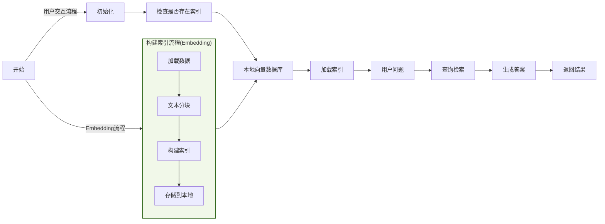
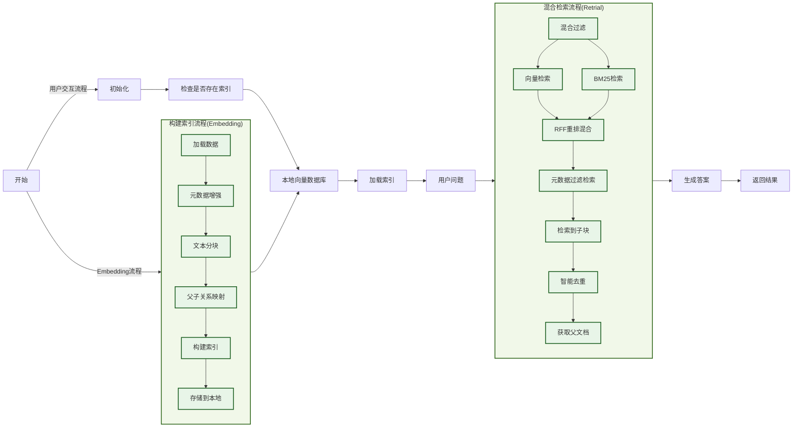

# 今天吃什么RAG知识库

本项目基于LLM和RAG系统搭建一个「今天吃什么」的知识库，使用最小可行性产品MVP的原则，从一个初级的通用RAG架构逐渐完善成生产可用的系统。

## 系统架构
**通用RAG架构**


**生产级RAG架构**


## 技术和模型
- **开发环境**：本地Python虚拟环境（需安装miniConda）
- **开发语言**：Python
- **核心API**：LangChain
- **向量化存储**：FAISS
- **LLM模型**：Kimi2.5
- **Embedding模型**：BAAI/bge-small-zh-v1.5（远程连接HuggingFace使用,需🪜）

## 安装使用
### 初始化python环境
**安装miniConda**
```bash
wget https://repo.anaconda.com/miniconda/Miniconda3-latest-Linux-x86_64.sh -O ~/miniconda.sh
bash ~/miniconda.sh
```
- 按 Enter 阅读许可协议
- 输入 yes 同意协议
- 安装路径提示时直接按 Enter（使用默认路径 /home/ubuntu/miniconda3）
- 是否初始化Miniconda：输入 yes 将Miniconda添加到您的PATH环境变量中。
```bash
source ~/.bashrc
conda --version
```
如果显示版本号，说明安装成功。

为了加快后续使用 conda 安装包的速度，强烈建议配置国内镜像源。打开一个新的终端或 Anaconda Prompt，运行以下命令：
```bash
conda config --add channels https://mirrors.tuna.tsinghua.edu.cn/anaconda/pkgs/main/
conda config --add channels https://mirrors.tuna.tsinghua.edu.cn/anaconda/pkgs/free/
conda config --set show_channel_urls yes
```
配置完成后，可以通过 `conda config --show channels` 命令查看已添加的源。

**配置API_KEY**
从MoonShot开发者平台申请API_KEY，配置到本地环境变量文件 `~/.bashrc` 中。
```bash
export MOONSHOT_API_KEY=[你的大模型 API 密钥]
```
保存文件后退出并执行 `source ~/.bashrc` 命令生效。

**创建虚拟环境**
```bash
conda create -n cook-rag python=3.12.11
conda activate cook-rag
```

**安装依赖文件**
```bash
pip install -r requirements.txt
```

**启动程序**
```bash
python main.py
```

## 版本及功能
### V1（tag-v1.0.0)
#### 版本介绍
使用通用RAG架构对数据做「基于Markdown文档结构的」分块和使用FAISS向量化，并存储到本地。用户输入问题后直接检索后，使用提示词发给大模型生成答案。

#### 项目流程


#### 提示词
输入用户问题和向量检索结果，使用简单的提示词让大模型生成答案。
```markdown
你是一位专业的烹饪助手。请根据以下食谱信息回答用户的问题。

用户问题: {question}

相关食谱信息:
{context}

请提供详细、实用的回答。如果信息不足，请诚实说明。
```

#### 模型效果
针对以下两类问答的回复各有优劣：
1. **给我推荐几道xx菜**：向量检索不准确（没有语义理解），只取Top k，依赖知识库的回答也不准确，模型自己补充答案，输出格式有废话不统一；
```markdown
> 今天吃什么，给我推荐几道江浙菜
根据您提供的食谱信息，我来为您分析：

## 符合江浙菜的推荐（1道）

**🐟 鳊鱼炖豆腐** —— 这是经典的江浙家常菜
- **特色**：鳊鱼肉质细嫩，搭配老豆腐炖煮，汤汁奶白浓郁，体现了江浙菜"鲜、嫩、软、滑"的特点
- **关键食材**：鳊鱼、老豆腐、冰糖、料酒、生抽
- **烹饪要点**：用冰糖提鲜（江浙菜典型手法），加入桂皮八角等香料，小火慢炖至汤汁浓稠

## 其他食谱的归属说明

从提供的食谱看，另外两道**不属于江浙菜**：
- **辣椒炒肉**：这是经典**湘菜**（湖南菜），以辣为主，与江浙菜的清淡鲜甜风格不同
- **黄油煎虾**：属于**西式/融合菜**，使用黄油和黑胡椒，不是传统江浙做法

---

## 额外推荐（如需更多选择）

如果您想尝试更多地道江浙菜，建议关注：
- **东坡肉**（杭帮菜代表）
- **糖醋排骨**（酸甜口，沪菜经典）
- **清蒸鲈鱼**（保留原味的苏菜）
- **腌笃鲜**（春笋咸肉炖汤，春季必吃）
- **响油鳝丝**（本帮菜经典）

**建议今天就做那道鳊鱼炖豆腐**，鱼肉鲜嫩，豆腐吸满汤汁，配米饭非常合适！需要具体的烹饪步骤吗？
```

2. **水煮鱼怎么做**：文档分成多个子块后，向量检索只能查到部分子块，依赖知识库的回答残缺不完整，模型自己补充答案，但是不可靠不统一；
```markdown
> 水煮鱼怎么做
根据您提供的食谱信息，**目前文档中关于水煮鱼的具体制作步骤是缺失的**，仅包含以下基础信息：

## 现有信息总结
- **菜品特点**：中等难度硬菜（★★★★），初学者预计用时约 **2 小时**
- **推荐食材**：巴沙鱼（富含优质蛋白且脂肪含量低），搭配时令蔬菜
- **营养特点**：高蛋白、低脂肪，配合蔬菜营养健康

## 信息不足说明
很抱歉，提供的食谱文档中**未包含水煮鱼的具体操作步骤**，例如：
- 鱼肉的切片与腌制方法
- 配菜（豆芽、白菜等）的处理
- 底料（花椒、干辣椒、豆瓣酱等）的炒制
- 煮鱼的火候控制
- 最后淋热油的"泼油"关键步骤

## 建议
由于水煮鱼对刀工（片鱼）、火候（煮制时间）和调味（麻辣底料）要求较高，建议您：
1. 查找包含详细步骤的完整水煮鱼食谱
2. 或选择文档中提供的**红烧鱼/红烧鲤鱼**做法（文档包含完整的煎鱼、调味、收汁步骤），但这与水煮鱼的清爽麻辣口感完全不同

如果您需要，我可以基于一般烹饪知识为您介绍水煮鱼的标准做法框架，但请注意这**并非来自您提供的食谱文档**。
```

#### 存在问题
- 仅支持向量检索，不理解用户语义，生成结果不准确
- 文本分块后检索，上下文不充分，生成结果不完整

### V1.2（tag-v1.2.0)
#### 版本介绍
在V1.0版本的通用RAG架构基础上，针对性的做了以下功能和优化：
- 检索优化：优化查询检索方式，使用向量检索+关键词检索，并使用RRF策略混合输出最终TopK
- 数据构建：文本分块时构建元数据，检索时在混合检索步骤后再做元数据过滤缩小检索范围
- 上下文扩展：使用"小块检索，大块生成"策略，文本分块时添加子块和父块映射，实现上下文扩展
- 智能去重：检索到多个子块后（可能存在重复），进行排序去重后，再获取父文档给大模型生成

#### 项目流程


#### 提示词
该版本的提示词和V1.0版本的保持不变。

#### 模型效果
针对以下两类问答的回复有所改进：
1. **给我推荐几道早餐**：向量检索可以准确检索到用户想要的早餐，而不是随机返回其他菜品，说明元数据增强和混合检索后的基于元数据的过滤生效了。但是用户可能只要菜品名字，不需要详细做法，回答可以直给菜品名，再简洁一些。
```markdown
根据您提供的食谱信息，我为您推荐以下两道营养早餐：

## 1. 牛奶燕麦（极简快手版）

**适合人群**：时间紧张的上班族、厨房新手、追求效率的懒人

**核心优势**：
- **难度极低**：★（非常简单）
- **极速出餐**：3分钟即可完成
- **营养均衡**：高蛋白+粗谷物纤维，饱腹感强

**食材配比**（单人份）：
- 牛奶 280ml（巴氏奶口感更佳）
- 快煮燕麦 40g
- 鸡蛋 1个（煎蛋搭配）

**制作要点**：
- **极速法**：快煮燕麦+牛奶混合，微波炉中火4分钟（注意容器不要超过50%容量，避免溢出）
- **常规法**：燕麦用200ml水煮沸2分钟后捞出，倒入冷牛奶中（口感更清爽）
- **煎蛋**：热锅少油，每面20秒，可撒3g椒盐提味

**搭配建议**：可加入水果、蔬菜或苏打饼干丰富口感

---

## 2. 燕麦鸡蛋饼（健身优选版）

**适合人群**：健身人群、需要持久饱腹感的上班族、喜欢热食的人

**核心优势**：
- **营养密度高**：含39g碳水、30g蛋白质、19g脂肪，共450kcal
- **口感丰富**：可咸可甜，可加入蔬菜（如菠菜）
- **便携性强**：饼状方便携带

**食材配比**（单人份）：
- 鸡蛋2个（或2个蛋清+1个蛋黄）
- 纯干燕麦片 50g
- 牛奶 50-100g（调至粘稠即可）
- 蔬菜碎叶一把（可选）

**制作要点**：
- **混合顺序**：牛奶与燕麦先混合至粘稠→加入打散的鸡蛋液搅拌均匀
- **火候控制**：必须使用**小火**，平底锅刷黄油，先煎2-3分钟，翻面再煎2分钟
- **调味建议**：咸口可在蛋液中加入盐、胡椒；甜口可搭配剩余牛奶食用

**关键提醒**：煎饼时务必小火，避免燕麦糊底

---

## 选择建议

| 需求场景 | 推荐选择 | 理由 |
|---------|---------|------|
| **赶时间/极简主义** | 牛奶燕麦 | 3分钟完成，无需厨艺，清洗简单 |
| **健身增肌/高强度工作** | 燕麦鸡蛋饼 | 蛋白质更高（30g），热量充足（450kcal），饱腹感持续更久 |
| **冬季/喜欢热食** | 燕麦鸡蛋饼 | 热食更暖胃，口感更扎实 |
| **夏季/清爽口感** | 牛奶燕麦 | 常温或冷藏牛奶搭配，入口舒适 |

两道早餐都基于燕麦和鸡蛋，食材重叠度高，您可以根据当天的时间和心情灵活选择！
```

2. **水煮鱼怎么做**：LLM给出的水煮鱼做法是根据知识库中水煮鱼的完整文档生成的，可见“小块检索、大块生成”的策略已经实现和生效，V1.0中向量检索的知识库不完整问题也不见了，在提示词不变的情况下，生成质量有明显的提升。
```markdown
**水煮鱼**是一道经典的川菜，以麻辣鲜香著称。根据食谱，这是一道**难度较高**（★★★★）的硬菜，使用巴沙鱼制作，搭配时令蔬菜，营养丰富。以下是详细做法：

---

### 🛒 **必备原料和工具**（3-5人份）

**主料：**
- 巴沙鱼：500g（需提前解冻）
- 时令蔬菜：300-500g（如土豆片、豆芽、花菜、生菜等，自由搭配）

**调味料：**
- 红油豆瓣酱：40g（嗜辣可再加10-20g）
- 豆豉：10g（可选）
- 藤椒油：10ml
- 菜籽油：25ml
- 白胡椒粉：3g
- 大蒜：2瓣
- 盐：5g（腌制用）+ 2g（调味用）
- 糖：2g

**工具：**
大不锈钢碗、量杯、厨房秤（可选）

---

### 👨‍🍳 **详细制作步骤**

#### **第一步：解冻与切片**
- **解冻**：冷冻巴沙鱼需室温自然解冻约**5小时**
- **切片技巧**：将鱼切成约**5cm长、3cm宽**的薄片
  - *切法要点*：垂直于鱼肉长条方向先剁成5cm的段，翻转90度斜着撇成薄片

#### **第二步：腌制（关键步骤）**
1. 鱼片放入大碗中，加入：
   - 豆瓣酱 30g
   - 盐 3g
   - 藤椒油 10ml
   - 白胡椒粉 3g
2. **用手轻轻抓匀**（不要太用力，以免鱼肉碎裂）
3. 加入 5ml 菜籽油"封油"锁住味道
4. **常温静置至少30分钟**入味

#### **第三步：准备配菜**
- 大蒜切成蒜末
- 蔬菜洗净：以花菜300g+生菜200g为例
- **花菜**：开水锅焯水备用
- **生菜**：洗净晾干，直接炒熟（**不放油**）

#### **第四步：炒制底料**
- 热锅冷油（菜籽油 20ml）
- 加入**10g豆瓣酱**、**10g豆豉**（可选）、**蒜末**
- **中火**慢炒出香味

#### **第五步：汆烫鱼片**
1. 锅中加入**150ml热水**
2. 水快开时，轻轻放入腌制好的鱼片
3. 用锅铲**轻轻翻动**让鱼片在水中散开（避免炒碎）
4. 加入**2g盐**和**2g糖**调味（可根据口味调整）
5. **水再次沸腾后即可出锅**（不要煮太久，以免鱼肉变老）

#### **第六步：盛盘**
1. 先将炒好的蔬菜垫在大碗底部
2. 将鱼片盛在蔬菜上面
3. 浇上锅中剩余的热汤即可！

---

### 💡 **重要提示与技巧**

1. **蔬菜搭配技巧**：
   - 垫底蔬菜可自由发挥，但**土豆需要先煮熟**（用筷子能戳透为准）
   - 花菜需焯水，生菜可直接干炒

2. **口味调整**：
   - 红油豆瓣酱决定辣度，可根据承受能力增减
   - 盐的用量分两次控制：腌制时固定，汆烫时可尝后调整

3. **操作要点**：
   - 鱼片要**斜着撇片**，这样厚薄均匀更易熟
   - 腌制时**轻柔抓拌**，保持鱼片完整
   - 汆烫时间**不宜过长**，水开即熟，保持嫩滑口感

4. **安全提醒**：
   - 处理冷冻鱼时注意完全解冻，避免外熟里生
   - 炒豆瓣酱时用中火，避免糊锅发苦

**预估用时**：初学者约需**2小时**（含解冻和腌制时间）

祝你做出麻辣鲜香、鱼肉嫩滑的水煮鱼！如有具体步骤不清楚，欢迎追问。
```

3. **我想吃下午茶了**：用户输入意图描述不够清晰，既没有说明是要下午茶清单、还是要下午茶做法，直接提供给用户大量做法信息，可能不太符合用户意图。

```markdown
根据您提供的食谱信息，我强烈推荐**英式司康**作为您的下午茶选择！这是一道经典的下午茶点心，制作相对简单，非常适合搭配茶或咖啡享用。

## 🫖 为什么推荐英式司康？

- **专为下午茶设计**：食谱明确说明这是"非常简单快手的下午茶甜品"
- **风味适中**：以蛋奶香气为主，糖量适中不会过于甜腻，非常适合下午时段
- **搭配灵活**：可搭配果酱、奶油奶酪、茶或咖啡
- **分享适宜**：一份正好够 4-6 人享用，适合与家人朋友分享

---

## 👨‍🍳 制作指南

### 所需材料（4-6人份）
- 无盐黄油 40g（推荐总统牌）
- 低筋面粉 180g
- 糖 30g
- 盐 1g
- 泡打粉 5g
- 鸡蛋 1个（约50g）
- 淡奶油 45g
- 奶油奶酪 50g（可选，但推荐）

### 详细步骤

**准备工作（15分钟）：**
1. **制作蛋奶液**：鸡蛋打散，取30g蛋液与淡奶油、奶油奶酪混合均匀。如果奶酪太硬，可水浴加热至40°C再混合
2. **混合干粉**：将低筋面粉、盐、糖、泡打粉放入容器混合均匀

**制作面团（10分钟）：**
3. **搓油**：黄油切小块，放入干粉中，用手捏搓成**粗玉米粉质地**（这是司康蓬松的关键）
4. **混合**：倒入蛋奶液，轻轻搅拌叠压成均匀面团（不要过度揉搓，避免出筋）

**成型与烘烤（35分钟）：**
5. **整形**：擀成1.5cm厚的面片，切成6个扇形（或用心形/圆形模具）
6. **刷蛋液**：用剩余20g蛋液刷表面，烤出金黄色泽
7. **烘烤**：烤箱预热180°C，烤27分钟

---

## 💡 下午茶搭配建议

**经典组合：**
- 趁热撕开司康，涂抹**草莓酱+凝脂奶油**（Clotted Cream）
- 搭配食谱中的**冬瓜茶**（清爽解腻）或英式红茶、拿铁咖啡

**进阶变化：**
- 可在面团中加入葡萄干、蔓越莓干或橙皮丁增加口感层次
- 如果没有奶油奶酪，可省略，但口感会稍欠浓郁

**保存提示：**
- 刚出炉最佳，常温当天食用完毕
- 吃不完密封保存，第二天复烤3-5分钟恢复酥脆

**预估时间**：准备20分钟 + 烘烤27分钟 = **约50分钟**

祝您下午茶愉快！如果想喝饮品搭配，文档中的冬瓜茶也是不错的选择，清爽解腻，与司康的奶香形成完美互补。
```

#### 存在问题
- 用户问“给我推荐几道xx菜”，回答包含菜品做法，冗长不够简洁，可以改为只推荐菜品名字；
- 用户查询不太清晰的时候，生成内容偏向菜品详细做法，可能不符合用户意图（用户可能是到店点单、也可能是在家做菜），要能够准确识别用户意图，生成可靠的答案。