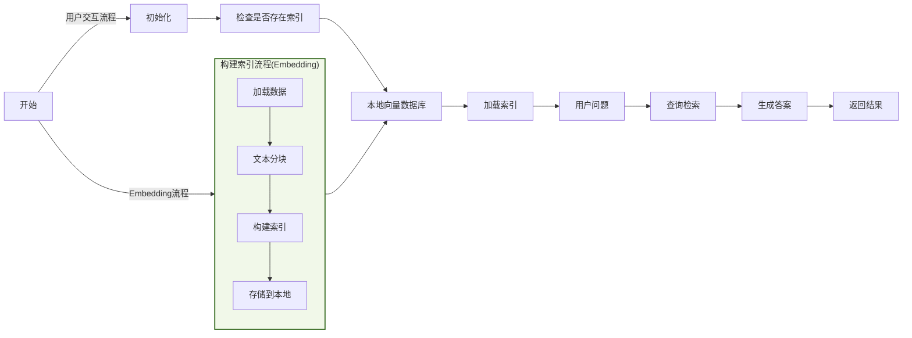
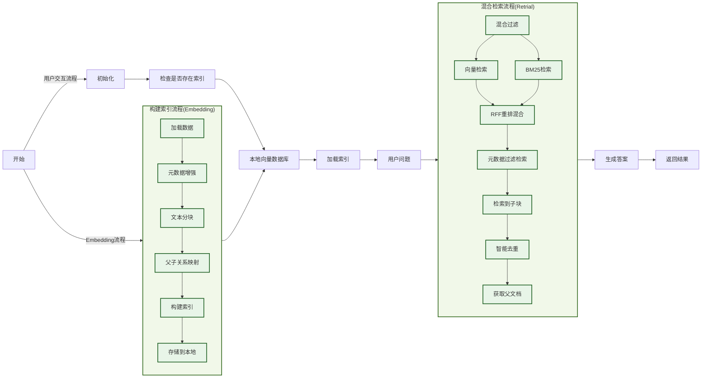
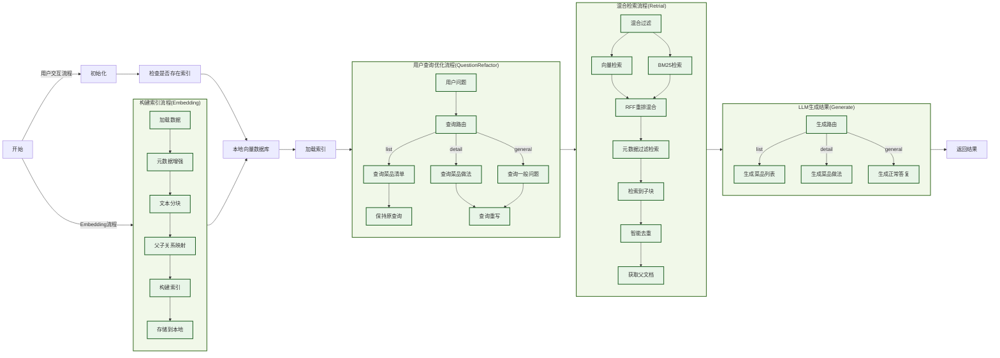

# 项目架构

## 初始版本 V1.0.0
### 实现功能
- **文本分块和向量化存储**：基于Markdown文档格式的分块，Embedding向量化后存储在本地FAISS数据库中
- **用户提问和向量化检索**：通过用户提问的内容检索相似度最接近的TopK文本块
- **提示工程和大模型生成**：根据提示词和TopK检索文本块输入给大模型生成答案

### 项目流程图

### 存在问题
- 仅支持向量检索，不理解用户语义，生成结果不准确
- 文本分块后检索，上下文不充分，生成结果不完整

## 升级版本 V1.2.0
### 实现功能
- **检索优化**：优化查询检索方式，使用向量检索+关键词检索，并使用RRF策略混合输出最终TopK
- **数据构建**：文本分块时构建元数据，检索时在混合检索步骤后再做元数据过滤缩小检索范围
- **上下文扩展**：使用"小块检索，大块生成"策略，文本分块时添加子块和父块映射，实现上下文扩展
- **智能去重**：检索到多个子块后（可能存在重复），进行排序去重后，再获取父文档给大模型生成

### 项目流程图

### 存在问题
- 用户问“给我推荐几道xx菜”，回答包含菜品做法，冗长不够简洁，可以改为只推荐菜品名字；
- 用户查询不太清晰的时候，生成内容偏向菜品详细做法，可能不符合用户意图（用户可能是到店点单、也可能是在家做菜），要能够准确识别用户意图，生成可靠的答案。

## 再升级版本 V1.5.0
### 实现功能
- **查询路由**：根据用户不同的查询意图，生成不同的查询类型；根据不同大的查询类型，使用不同方式生成回复；
- **查询构建**：对用户描述不清楚的问题，进行前置的LLM翻译或多轮交互，明确问题意图后再发送LLM生成答案。

### 项目流程图

### 存在问题