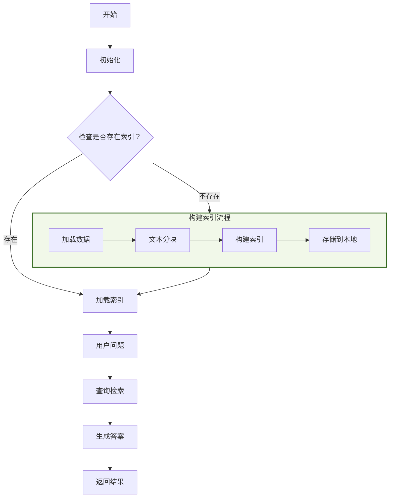

# 项目架构

## 初始版本

```mermaid
flowchart TD

%% 系统初始化
START[开始] --> SYSTEM_INIT[初始化]

%% 知识库构建
SYSTEM_INIT --> INDEX_CHECK{"检查是否存在索引？"}
INDEX_CHECK --> |存在| LOAD_INDEX[加载索引]
INDEX_CHECK --> |不存在| BuildIndex
BuildIndex --> LOAD_INDEX

%% 用户检索
LOAD_INDEX --> USER_QUERSTION[用户问题]
USER_QUERSTION --> QUERY_RETRIAL[查询检索]

%% LLM生成
QUERY_RETRIAL --> GENERAL_ANSWER[生成答案]
GENERAL_ANSWER --> RESPONSE_USER[返回结果]

%% 构建索引子流程
subgraph BuildIndex [构建索引流程]
    LOAD_DATA[加载数据] --> DATA_CHUNCK[文本分块] 
    DATA_CHUNCK --> BUILD_INDEX[构建索引]
    BUILD_INDEX --> STORE_INDEX[存储到本地]
end


%% 样式定义
classDef module fill:#f1f8e9,stroke:#33691e,stroke-width:2px

%% 样式应用
class BuildIndex module

```